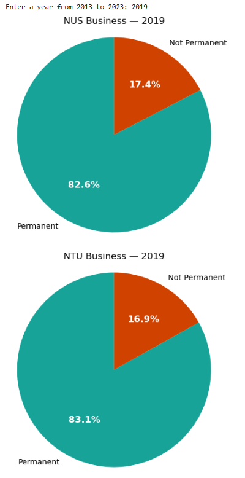

"Major Universities' Graduate Employment Survey"
 

This was for my second semester assigbment.

It was based on the Data.gov.sg, Graduate Employment Survey Dataset
https://data.gov.sg/datasets?query=graduate+employment&page=1&resultId=d_3c55210de27fcccda2ed0c63fdd2b352

The study covers overall employment versus permanent employment from National University of Singapore (NUS) and Nanyang Technological University of Singapore (Singapore).

It counts and allows for yearly percentages of employment from 2013 to 2023.

The permanent employment percentages of graduates appears to be at steady 80% up till 2023 in spite of the pandemic.

## Employment rates

The code was constructed using Python, Pandas and MatPlotLib.
